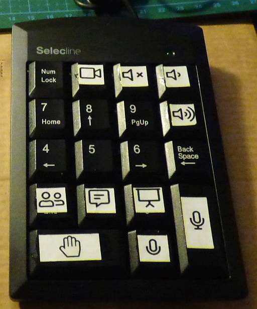
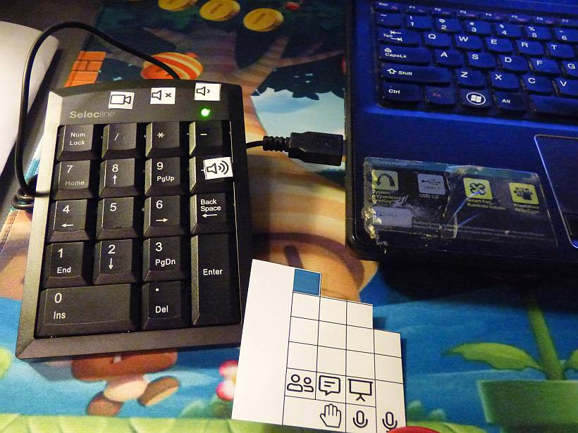
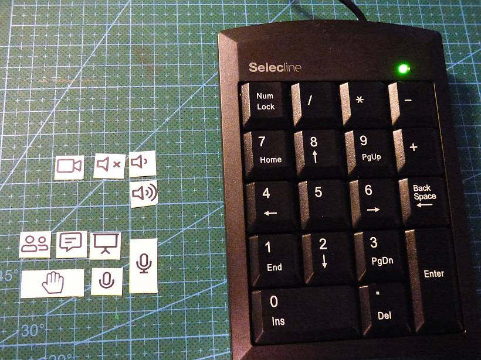
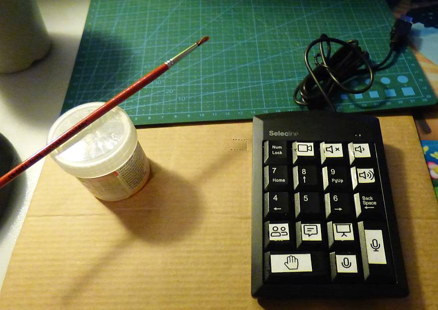

# MS Teams control deck

This is a script I prepared for my 7 y.o. son to make it easier for him to participate in remote learning lessons.

He needs to be able to quickly and easily:

- mute/unmute microphone (muted microphones are a must with any online meeting for more than 7 people)
- raise/lower hand whenever he wants to ask for something or singal that he wants to answer teacher's question

There is a really awkward keyboard shortcut for the microphone control (Ctrl+Shift+M) and there is no shortcut at all for raising hand.

He is able to do these actions using mouse but just not fast enough. Keyboard shortcuts are always better than using a mouse, and a special deck is better then keyboard shortcuts.

# Installation

1. Download and install autohotkey from <https://www.autohotkey.com/>.
2. Download **msteams-deck.ahk** file from this repository
3. Double click on it to make the script active

# How it works?

It doesn't matter if you have full-size keyboard with numpad or if you use USB-attached one, they will work the same.
The status of Numpad LED doesn't matter, both key functions (i.e. numpad 2 and numpad cursor down) are intercepted.

The script is active only when *Teams.exe* is running.

Whenever you press one of the shortcut keys the Teams window will be activated and a keypress or mouse action will be sent to it.

# Shortcuts

These are the intercepted numerical pad keys:

| key | fa-icon | function |
|----:|:---:|-----|
| **Enter** | [icon](https://fontawesome.com/icons/microphone?style=regular) | mute/unmute microphone |
| **dot/Del** | [icon](https://fontawesome.com/icons/microphone?style=regular) | push-to-talk (or push-to-mute) whenever you want to temporarily toggle microphone status to say "Yes" or "I'm present" or (if it's your turn) to spare other participants from hearing your cough or sneeze|
| **0/Ins** | [icon](https://fontawesome.com/icons/hand-paper?style=light) | raise/lower hand |
| **1/End** | [icon](https://fontawesome.com/icons/user-friends?style=solid) | open/hide list of participants |
| **2/down** | [icon](https://fontawesome.com/icons/comment-alt-lines?style=light) | open/hide chat window |
| **3/PgDn** | [icon](https://fontawesome.com/icons/presentation?style=regular) | open/hide screen sharing options |
| **/** | [icon](https://fontawesome.com/icons/video?style=solid) | camera on/off |
| **+** | [icon](https://fontawesome.com/icons/volume-up?style=solid)| volume up |
| **-** | [icon](https://fontawesome.com/icons/volume-down?style=solid) | volume down |
| * | [icon](https://fontawesome.com/icons/volume-mute?style=solid) | mute on/off |

# Keyboard labels

If you are like me you are going to forget about those key assignments very soon.

I have used icons from <https://fontawesome.com/> and printed them out on a 1cm x 1cm grid, so every icon has maximum width or height of about 9mm.

This is the arrangement next to the deck:

I have used a spare USB numpad and glued icons to it using a clear acrylic paint.

